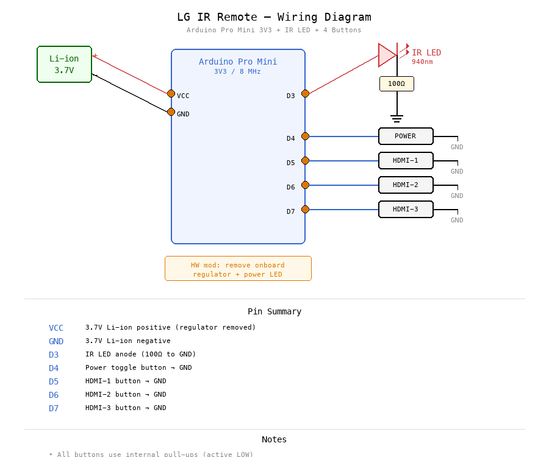

# LG Smart TV IR Remote — Arduino Pro Mini 3V3

A minimal, battery-powered IR remote for LG Smart TVs. Sends NEC-protocol commands for **Power**, **HDMI-1**, **HDMI-2**, and **HDMI-3** input switching.

## Hardware

| Component | Specification |
|---|---|
| MCU | Arduino Pro Mini 3V3 (ATmega328P, 8 MHz) |
| IR LED | 940 nm, 100 Ohm series resistor to GND |
| Buttons | 4x momentary push buttons (active LOW, internal pull-ups) |
| Power | 3.7 V Li-ion cell connected directly to VCC (regulator bypassed) |

## Wiring

| Pin | Connection |
|---|---|
| VCC | 3.7 V Li-ion (+) (regulator bypassed) |
| GND | 3.7 V Li-ion (-) |
| D3 | IR LED anode (cathode through 100 Ohm to GND) |
| D4 | Power button to GND |
| D5 | HDMI-1 button to GND |
| D6 | HDMI-2 button to GND |
| D7 | HDMI-3 button to GND |



<details>
<summary>Text diagram</summary>

```
Arduino Pro Mini 3V3

  3.7V Li-ion (+) ──> VCC  (regulator removed)
  3.7V Li-ion (-) ──> GND

  D3 ───>|──── 100Ω ──── GND    (IR LED, 940 nm)

  D4 ──┤ POWER  ├── GND
  D5 ──┤ HDMI-1 ├── GND
  D6 ──┤ HDMI-2 ├── GND
  D7 ──┤ HDMI-3 ├── GND
```

</details>

## IR Protocol

- **Protocol:** NEC, 32-bit, 38 kHz carrier
- **Device address:** `0x04` (inverted: `0xFB`)
- **Frame format:** `(addr)(~addr)(cmd)(~cmd)`

| Button | Command |
|---|---|
| Power | `0x08` |
| HDMI-1 | `0xCE` |
| HDMI-2 | `0xCC` |
| HDMI-3 | `0xE9` |

## Power Saving

- `SLEEP_MODE_PWR_DOWN` between button presses
- Wake via pin-change interrupt (PCINT2) on D4-D7
- ADC, SPI, and TWI peripherals disabled
- BOD disabled during sleep
- Digital input buffers disabled on unused analog pins
- Onboard voltage regulator and power LED removed (hardware mod)

## Dependencies

- [IRremote](https://github.com/Arduino-IRremote/Arduino-IRremote) library

Install via the Arduino IDE Library Manager or `arduino-cli lib install "IRremote"`.

## Building

1. Open `lg_ir_remote/lg_ir_remote.ino` in the Arduino IDE
2. Select **Board:** Arduino Pro or Pro Mini
3. Select **Processor:** ATmega328P (3.3V, 8 MHz)
4. Compile and upload via an FTDI adapter

## License

MIT
